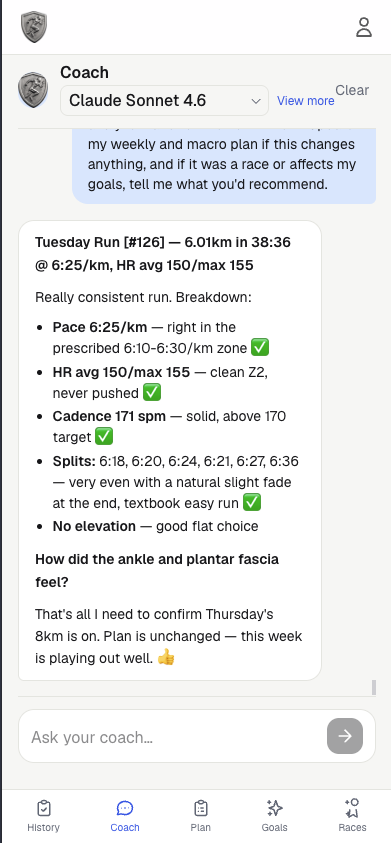
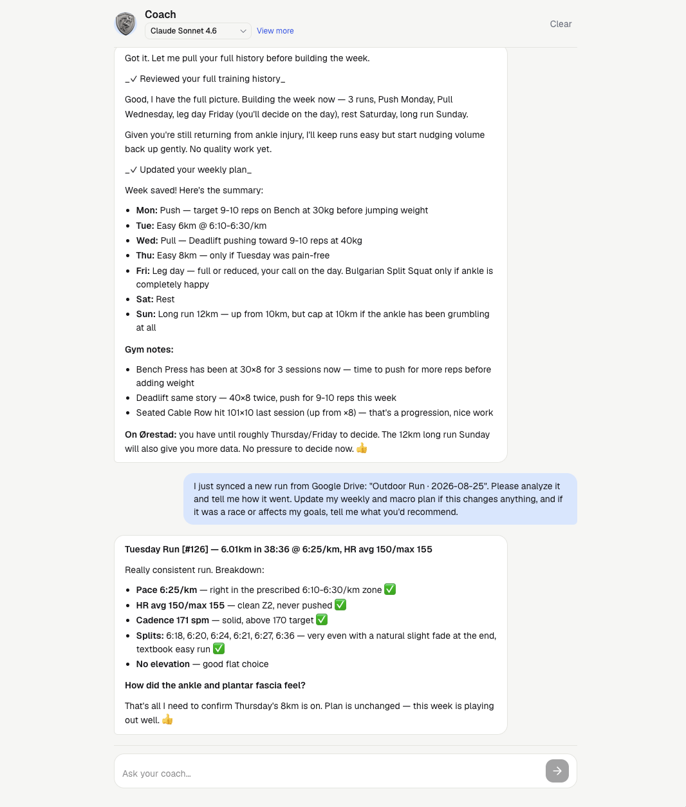
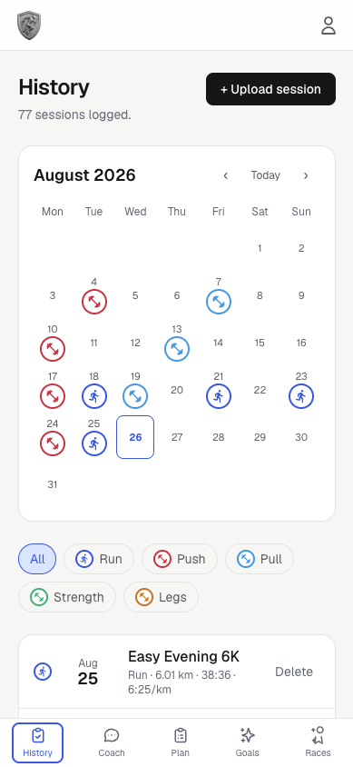
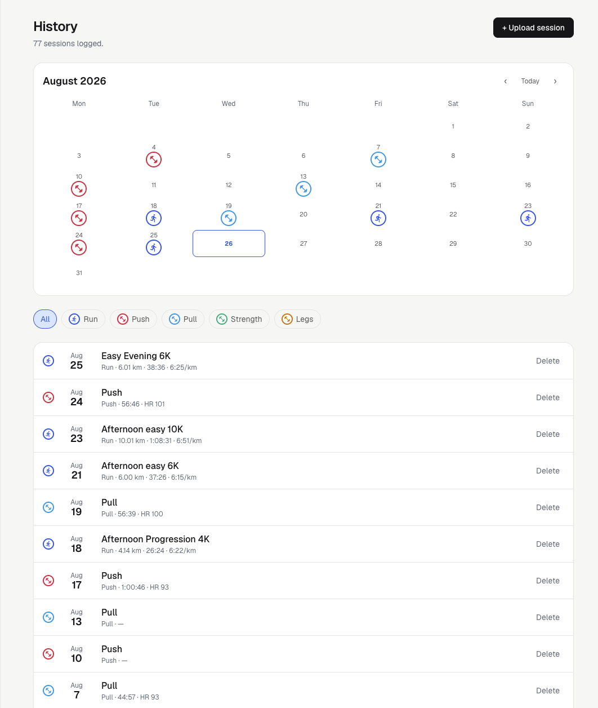
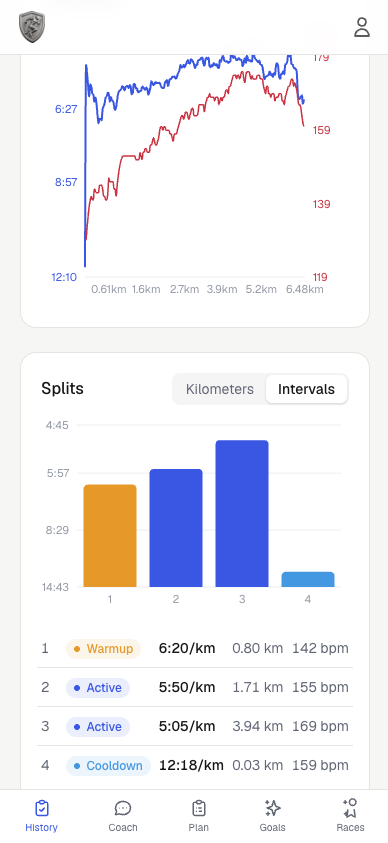
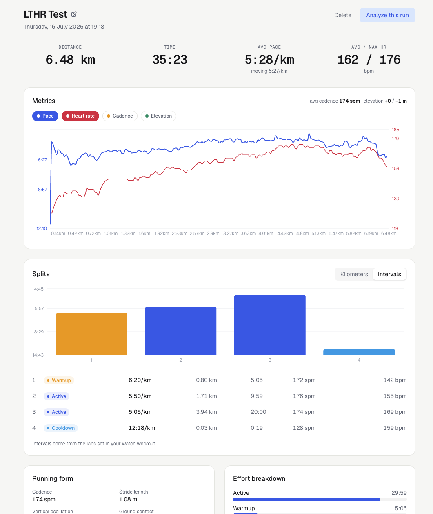
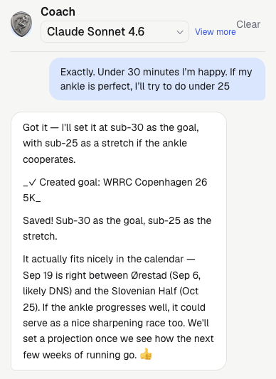
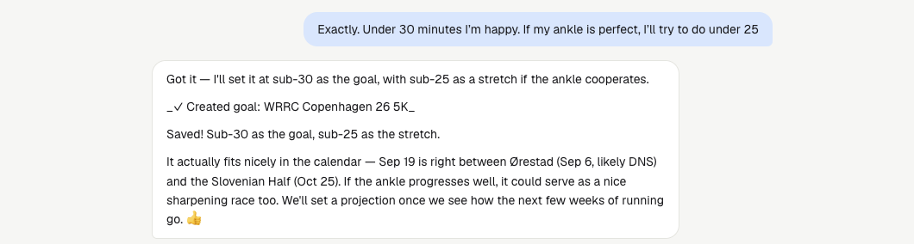
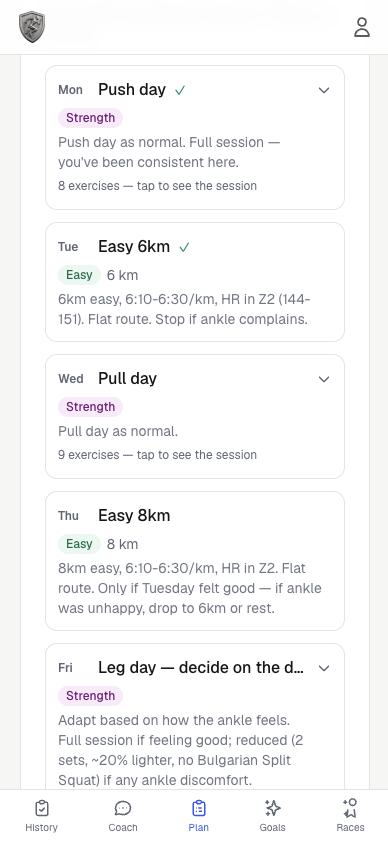
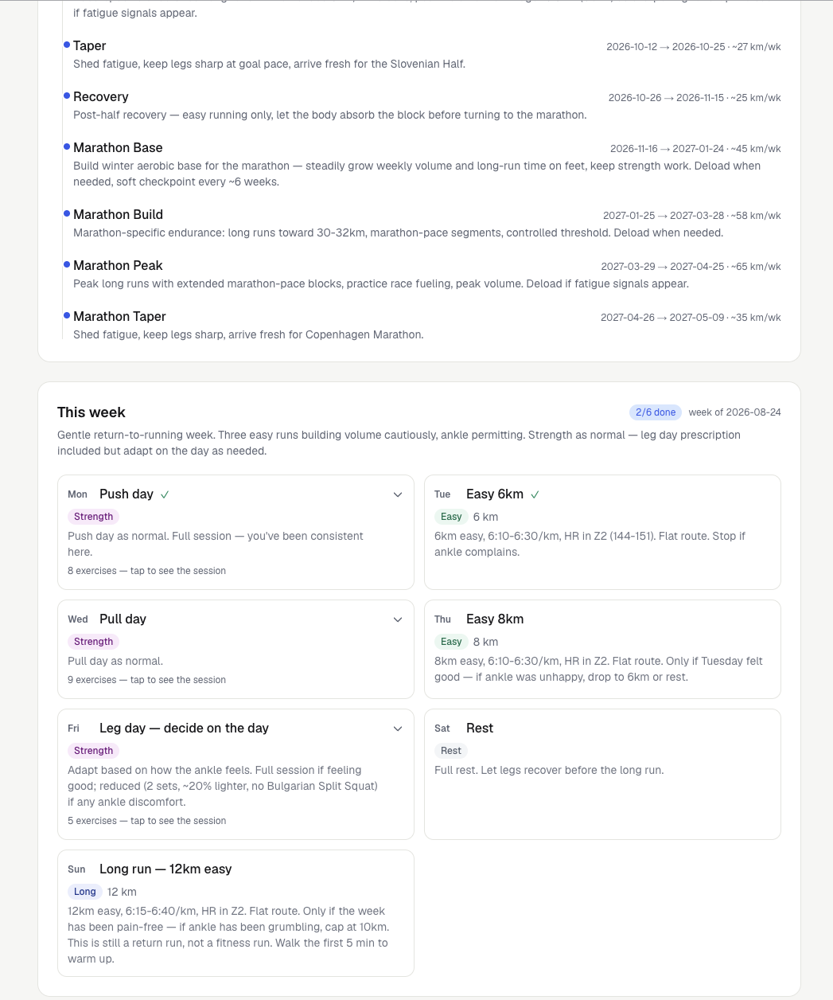

## Overview

Gunna is a training log with an opinion. It ingests workouts from Apple Watch
and Garmin, computes the metrics that matter for distance running, and puts an
AI coach on top that sees your goal, your full history and your recovery data,
so the feedback after each run is grounded in _your_ training, not generic
advice. It covers strength training too: gym sessions are parsed, merged with
watch data and factored into the weekly plan.

It is built for exactly one runner: me. Training for a half marathon while
lifting twice a week, on a phone, on the couch, ten minutes after finishing a
session.

  

    
Role

    
Solo. Product decisions, data model, parsers, coach and UI.

  

  

    
Scope

    
Ingest, metrics, plan and coach. One athlete, running and strength together.

  

  

    
Constraints

    
Serverless, no workers, no ops budget. Must survive a free model provider retiring a model overnight.

  

_Every imported run opens with this. The coach has already read the splits, the
heart-rate zones and last night's sleep before it says anything._

That reply is the whole product. Everything below is what it took to make a
few sentences worth trusting.

## The problem

Running apps show you charts; they don't coach. And the data you'd coach from is
scattered, the run lives in HealthFit or Garmin, the lifting session in Strong,
recovery metrics in Apple Health. Three apps, none of which know the other two
exist, so the one thing nobody can see is the whole week.

I wanted one place where all of it lands automatically, and one coach that
reasons over the whole picture and can actually change the plan.

## One training picture

Six ingest paths, all converging on a single parser core. Whichever way a
session arrives, it lands in the same shape.

  

    

      
File upload

      
.fit · .tcx · CSV

    

    

      
Google Drive

      
HealthFit auto-import

    

    

      
Garmin Connect

      
activity archives

    

    

      
Garmin bulk CSV

      
history backfill

    

    

      
Strong / Hevy

      
pasted gym sessions

    

    

      
Apple Health

      
HR · HRV · sleep · weight

    

  

  
↓

  

    
One parser core

    
normalised sessions · one dedupe rule · one history

  

Two of those paths are worth naming. **Garmin Connect sync** downloads the
original activity archives, unzips them in memory and stores only
AES-256-GCM-encrypted session tokens, never the password. **Strong and Hevy
pastes** are gym sessions read from clipboard text in two languages and both
date orders, then merged with the matching watch file so one session doesn't
become two rows.

  
Dedupe lives in the database

  

    A partial unique index on the source file, plus start-time matching, plus a
    "more samples wins" upgrade — so a summary-only import is silently replaced
    when the full per-second file turns up later. Six ingest paths, one rule,
    enforced where no code path can route around it.
  

_Runs and lifts in one timeline. Which app the session came from stops being
something I have to remember._

## Metrics that hold up

The parser turns raw samples into per-km splits interpolated at exact 1000 m
boundaries, lap and interval breakdowns, elevation with a GPS-jitter deadband,
running-form metrics, ACWR training load, personal records and Riegel race
projections.

_Splits, zone distribution and form metrics on one page. The numbers the coach
is reading when it answers._

Two decisions did most of the work:

  

    
Zones are re-sliceable

    

      Zone time is computed from a stored per-bpm histogram, not baked in at
      import. Log a new LTHR test and every run in history re-slices instantly,
      with no reparse.
    

  

  

    
Cadence despiking

    

      Apple Watch drops step detection mid-run, poisoning averages and stride
      length. Each sample is compared against the 65th percentile of its
      neighbourhood — not the median, because dropouts cluster and drag a median
      down until it stops flagging them — and only repaired where speed says you
      were clearly still running. Deliberate walk breaks survive.
    

  

The rest of this layer is unglamorous defensive work. European exports are
semicolon-separated with decimal commas, inside timestamps too, so everything
is parsed positionally and never with a global replace. Backfilling hundreds of
days of health metrics row by row blew past the serverless function limit, so
the merge happens in memory by date and writes in batches.

## A coach that can act

The coach's context is rebuilt fresh for every message from parallel queries:
goals, the macro plan, the current week in full detail, adherence, HR zones,
recent runs, gym history, daily health metrics and training load. It doesn't
just talk, it has eleven write tools, so "let's move the long run to Sunday"
actually edits the plan. Responses stream, and each executed tool appears inline
as a ✓ receipt.

That matters most on a bad day. When resting HR is climbing, HRV is sagging and
the last three nights were short, the coach is told to weigh recovery over the
schedule, say so in plain terms, and then _rewrite the week_ — easier Tuesday,
long run pushed back, heavy legs off the day before quality work. The advice and
the plan change in the same reply, or neither does.

_Asking the coach to move a session. The ✓ line is the actual write, if it
isn't there, nothing changed._

Because strength is in the same picture, the week is planned as one thing: runs
arranged around lifting rather than on top of it, and each gym day carrying its
own prescription, exercise, sets, reps and a target weight progressed from what
I actually lifted last time.

_One week, both disciplines. Quality run days land on fresh legs because the
plan knows when leg day was._

Models are pluggable: Claude with your own API key, or free OpenAI-compatible
open models. That split shaped the architecture, Claude gets the full context
with prompt caching, so the static prefix re-reads at roughly a tenth of the
cost across the agentic loop, while free models get a deliberately leaner
context, shorter history and fewer loop turns so their token quotas last.

  

    
Models are benchmarked, not trusted

    

      A harness runs the production system prompt, tools and agentic loop against
      candidate models on scored scenarios — build a full week, edit one day
      without regressing the other six, know when <em>not</em> to call a tool —
      validating every tool call against its JSON schema. Models are promoted or
      dropped on results. Free providers retire models without warning.
    

  

  

    
The guardrail that mattered most

    

      A model writing "I've updated your plan" in prose changes nothing. Plans
      only change through tool calls, so the system prompt says so explicitly and
      the app never trusts narration over state. Open models also emit numbers as
      strings, so a schema-aware coercion layer casts <code>"40"</code> back to
      <code>40</code> before execution.
    

  

## Living with it

The habit change was smaller than I expected and stuck harder. I stopped
exporting files by hand, which means I stopped skipping the export and losing
sessions. The plan page became the thing I open before the gym instead of
deciding what to lift while standing in front of the rack. And because the coach
sees sleep and HRV alongside the training, the answer to "should I do the hard
session today?" stopped being a coin flip I resolved in favour of ego.

What I got wrong first: I built the coach before the metrics were trustworthy.
Early feedback was confident and subtly wrong, because cadence dropouts and
mis-sliced zones were feeding it. Fixing the parser improved the coaching more
than any prompt change did.

<!-- Replace this with a real coach reply from your own history — a genuine one
     after a hard or bad session is worth more than any description above. -->

## What I learned

Real-world fitness data is adversarial: units change meaning between sources,
watches drop sensors mid-run, and every exporter localises differently. The
answer that held up was pushing invariants down, dedupe as a database
constraint, zones from histograms instead of precomputed buckets, one parser
core no matter the ingest path, and measuring model behaviour with a harness
instead of trusting it.

The product lesson is narrower and more useful: an AI feature is only as honest
as the data underneath it, and only as useful as the actions you let it take.

## Where it lands

Gunna turns three disconnected apps into one week a runner can actually train
by, where the advice after a hard session accounts for last night's sleep, and
where changing the plan takes one sentence instead of an afternoon.

Next.js (App Router) · React · TypeScript · Tailwind CSS · PostgreSQL (raw SQL) ·
Anthropic SDK · Garmin FIT SDK · Google Drive &amp; Sheets APIs · Recharts · JWT
auth with scrypt hashing and per-user data scoping.

